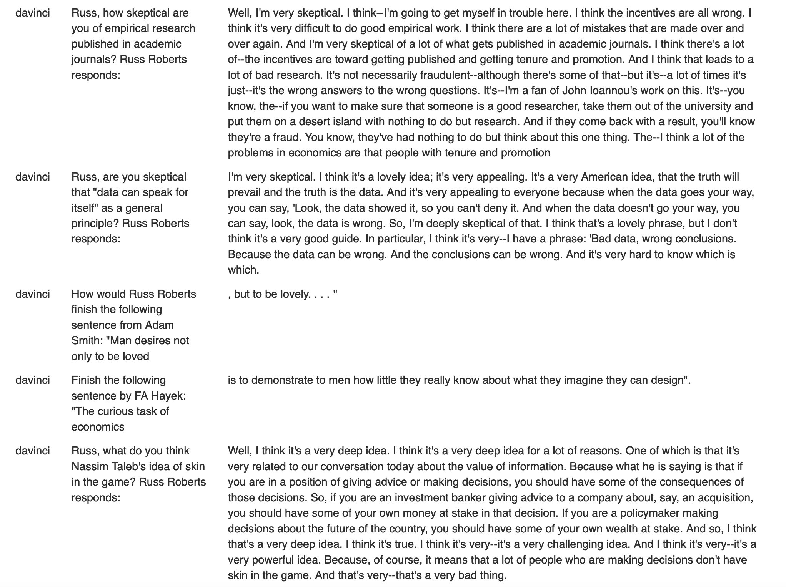

# EconChattR

This purpose of this repo is to create four fine-tuned versions of [GPT-3 models](https://beta.openai.com/docs/models/gpt-3) models to sound like Russ Roberts who is the host of [EconTalk](https://www.econlib.org/econtalk/) (a popular economics podcast that has produced weekly epsidoes for almost two decodes).

A more detailed write up results can be [found here](https://www.erikdrysdale.com/finetune_gpt3/).

The data used to fine-tune the models comes from the EconTalk episode transcripts which span from Jan 11th 2012 to December 20th 2022. 

For any additional questions please feel free to email me.

## (1) Running the pipeline

First, a note of caution. Different users who run this pipeline will get different results for two reasons. First, as new EconTalk episodes are added, the corpus and hence training data will expand. Second, the OpenAI API does not currently support seeding so the same call will produce difference results for both training and inference. 

Before running the main pipeline, users will need to ensure the following two conditions are met to ensure stability:

1. Set up the `econtalk` conda environment: `conda env create -f env.yml`
2. Install a working version of R (tested version 4.2.2), `XML` (tested version 3.99-0.13), `rvest` (tested version 1.0.3), and `tidyverse` (tested version 1.3.2); see `R.info` for more information

After a working version of R and conda have been set up, the `pipeline.sh` can be run which will generate all the necessary data files as well as update the output files. This shell script calls in the following R and python scripts:

* [1_scrape.R](1_scrape.R): Gets a list of the EconTalk episodes and downloads their raw transcripts to the data/ folder as raw_transcripts.txt
* [2_process_transcripts.py](2_process_transcripts.py): Carries out a variety of string cleaning processes and saves the resulting transcripts to a prommpt (guest)/completion (Russ) jsonl structure in the data folder: prompt_completion.jsonl
* [3_prepare_training.py](3_prepare_training.py): Creates data subsets to ensure that key "Russ" dialogue pairs are saved for model-specific training sets that will cost less than $10 for training
* [4_tune_models.py](4_tune_models.py): Submits model-specific requests to OpenAI to create fine-tuned models
* [5_prompt_baseline.py](5_prompt_baseline.py): Calculates the cost of running the prompt for the custom models and gets baseline answers to the prompts which will be used for the experiments

## (2) Model training

To carry out model training and inference, users will need to have an account with OpenAI and ~$40 of credit. See OpenAI's [documentation](https://beta.openai.com/docs/guides/fine-tuning) for more information about this. 

Users will need the following variables to the environment (I put it in their `.bash_profile` or `.bashrc`).

`export OPENAI_API_KEY="sk-...."`

`export OPENAI_ORG_ID="org-..."`

The `3_prepare_training.py` script has two optional argument: --n_epochs and --max_cost. Changing these values from what is hard-coded into `pipeline.sh` will lead to different training datasets and hence a different runtime cost (currently set to run for 4 epochs and cost no more than $10 USD). 

When the `4_tune_models.py` script is called, it will submit the model fine-tuning request one model at a time. In other words, fine-tuning requests are NOT sent in parallel. Additionally, once training is completed and a confirmation message is received from OpenAI users will need to press some key to continue before the next model is trained (i.e. this script cannot be run overnight but rather needs some supervision). This is done to ensure that any issues are spotted before $40 is spent to train four models.

## (3) Inference

To carry out inference on the EconChatR GPT-3 models, users can either query the models using the `openai.Completion.create(...)` command or by using the OpenAI playground, selecting the custom model, setting the temperature to 0.6 and the maximum length to 250. The entire [baseline](output/results_baseline.csv) and [fine-tuned](output/results_finetune.csv) prompt/completions "Russ-sounding" experiments can be found here. A more detailed write up results can be [found here](https://www.erikdrysdale.com/finetune_gpt3/).

The screenshot below shows some of the completion/prompt experiments for the fine-tuned `text-davinci-003` model.

 

